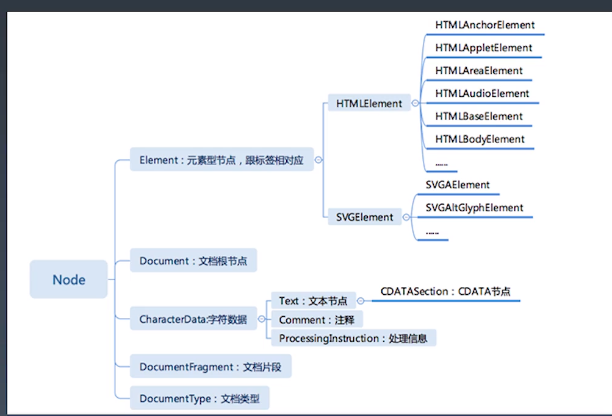

学习笔记

## 重学 HTML

### HTML 的定义

-   DTD 与 XHTML namespace
    -   HTML5 之后不再认为自己是 SGML 的子集
    -   DTD
        -   一般指文档类型定义。文档类型定义（DTD，Document Type Definition）是一种特殊文档，它规定、约束符合标准通用标示语言（SGML）或 SGML 子集可扩展标示语言（XML）规则的定义和陈述.
    -   http://www.w3.org/TR/xhtml1/DTD/xhtml1-strict.dtd
    -   http://www.w3.org/1999/xhtml
    -   **special.ent**
        -   双引号 `&quot;` `&#34;`
        -   &符号 `&amp;` `&#38;`
        -   小于号 `&lt;` `&#60;`
        -   大于号 `&gt;` `&#62;`

### HTML 标签语义

-   例子
    -   ```html
        <!DOCTYPE html>
        <html lang="en">
            <head>
                <meta charset="UTF-8" />
                <meta
                    name="viewport"
                    content="width=device-width, initial-scale=1.0"
                />
                <title>wiki</title>
            </head>
            <body>
                <aside>顶部 <a href="#">Log in</a></aside>
                <aside>侧边栏</aside>
                <main>
                    <article>
                        <hgroups>
                            <h1>主标题</h1>
                            <h2>副标题</h2>
                        </hgroups>
                        <p class="note">
                            <abbr title="">WWW </abbr>
                            注释
                        </p>
                        <figure>
                            
                            <figcaption>图片说明</figcaption>
                        </figure>
                        <p>
                            <strong>www</strong>
                            段落内容
                        </p>
                        <nav>
                            目录
                            <ol>
                                <li>目录项</li>
                                <li>目录项</li>
                                <li>目录项</li>
                                <li>目录项</li>
                                <li>目录项</li>
                            </ol>
                        </nav>
                        <p>
                            xxxxxxxxxxxxxxxxxxxx
                            <dfn>定义</dfn>xxxxxxxxxxxxxxxxxxxx
                        </p>
                        <samp>
                            <pre>
                            
                            预设置格式文本
                            
                            </pre>
                        </samp>
                        <code>
                            <pre>
                                &lt;html&gt;
                                    &lt;head&gt;
                                        &lt;title&gt;
                                            xxxxxxxxxxxxxxxxxxxx
                                        &lt;/title&gt;
                                    &lt;/head&gt;
                                    &lt;body&gt;
                                        &lt;p&gt;
                                            xxxxxxxxxxxxxxxxxxxx
                                        &lt;/p&gt;
                                    &lt;/body&gt;
                                &lt;/html&gt;
                            </pre>
                        </code>
                    </article>
                </main>
                <footer>页脚</footer>
            </body>
        </html>
        ```

### HTML 语法

-   合法元素
    -   ELement: `<tagname>...</tagname>`
    -   Text: text
    -   Comment: `<!--comments-->`
    -   DocumentType: `<!Doctype html>`
    -   ProcessingInstruction: <?a 1?>
    -   CDATA: <![CDATA[]]>
-   字符引用
    -   `&#161`
    -   ` &amp;`
    -   ` &lt;`
    -   ` &quot;`

## 浏览器 API

### DOM API

-   traversal 系列 —— 不建议用
-   Node 节点
    -   
    -   导航类操作 —— 忽略 text 节点
        -   parentNode
        -   parentElement
        -   childNodes
        -   children
        -   firstChild
        -   firstElementChild
        -   lastChild
        -   lastElementChild
        -   nextSibling
        -   nextElementSibling
        -   previousSibling
        -   previousElementSibling
    -   修改操作
        -   appendChild
        -   insertBefore
        -   removeChild
        -   replaceChild
    -   高级操作
        -   compareDocumentPosition
            -   比较两个节点中关系的函数
        -   contains
            -   检查一个节点是否包含另一个节点的函数
        -   isEqualNode
            -   检查两个节点是否为完全相同
        -   isSameNode
            -   检查两个节点是否是同一节点，实际上在 JS 中可以用'==='
        -   cloneNode 复制一个节点，参数传 true 表示深拷贝
-   event 事件
    -   addEventListener()
    -   冒泡与捕获
-   Range

    -   问题：

        -   把一个元素的所有子元素逆序
        -   Node.appendChild() 方法将一个节点附加到指定父节点的子节点列表的末尾处。**如果将被插入的节点已经存在于当前文档的文档树中，那么 appendChild() 只会将它从原先的位置移动到新的位置（不需要事先移除要移动的节点）。**这意味着，一个节点不可能同时出现在文档的不同位置。所以，如果某个节点已经拥有父节点，在被传递给此方法后，它首先会被移除，再被插入到新的位置。
        -   若要保留已在文档中的节点，可以先使用 Node.cloneNode() 方法来为它创建一个副本，再将副本附加到目标父节点下。
        -   请注意，用 cloneNode 制作的副本不会自动保持同步。如果给定的子节点是 DocumentFragment，那么 DocumentFragment 的全部内容将转移到指定父节点的子节点列表中。
        -   ```html
            <!DOCTYPE html>
            <html lang="en">
                <head>
                    <meta charset="UTF-8" />
                    <meta
                        name="viewport"
                        content="width=device-width, initial-scale=1.0"
                    />
                    <title>Document</title>
                </head>
                <body>
                    <div id="a">
                        <span>1</span>
                        <p>2</p>
                        <p>3</p>
                        <div>4</div>
                    </div>
                </body>
                <script>
                    let el = document.getElementById("a");

                    // function reverseChildren(element) {
                    //     let children = Array.prototype.slice.call(element.childNodes);

                    //     for (let child of children) {
                    //         element.removeChild(child);
                    //     }
                    //     // element.innerHTML = "";

                    //     children.reverse();

                    //     for (let child of children) {
                    //         element.appendChild(child);
                    //     }
                    // }

                    // function reverseChildren(element) {
                    //     let len = element.childNodes.length;
                    //     while (len-- > 0) {
                    //         element.appendChild(element.childNodes[len]);
                    //     }
                    // }

                    // 最优答案，2次DOM操作
                    function reverseChildren(element) {
                        let range = new Range();
                        range.selectNodeContents(element);

                        let fragment = range.extractContents();
                        let len = fragment.childNodes.length;
                        while (len-- > 0) {
                            fragment.appendChild(fragment.childNodes[len]);
                        }
                        element.appendChild(fragment);
                    }

                    reverseChildren(el);
                </script>
            </html>
            ```

    -   setStartBefore
    -   setEndBefore
    -   setStartAfter
    -   setEndAfter
    -   selectNode
    -   selectNodeContents
    -   ```js
        var range = new Range(); // 可精细化到半个节点的操作
        // range.setStart(element, 9);
        // range.setEnd(element, 4);
        // var range = document.getSelection().getRangeAt(0);
        var fragment = range.extractContents(); // 删除
        range.insertNode(document.createTextNode("aaaa")); // 插入
        ```

### CSSOM

-   对 CSS 文档的抽象
-   document.styleSheets
    -   Rules
        -   ```js
            document.styleSheets[0].cssRules;
            document.styleSheets[0].insertRule("p {color:pink;}", 0);
            document.styleSheets[0].removeRule(0);
            ```
        -   CSSStyleRule
            -   selecrorText String
            -   style K-V 结构
        -   getComputedStyle
            -   window.getComputedStyle(elt,pseudoElt)
                -   elt 想要获取的元素
                -   pseudoElt 可选，伪元素

### CSSOM View

-   window
    -   window.innerHeight,window.innerWidth
    -   window.outerHeight,window.outerWidth
    -   **window.devicePixelRatio**
    -   window.screen
        -   window.screen.width
        -   window.screen.height
        -   window.screen.availWidth
        -   window.screen.availHeight
    -   window.open("about:blank","blank")
    -   moveTo(x,y)
    -   moveBy(x,y)
    -   resizeTo(x,y)
    -   resizeBy(x,y)
-   scroll
    -   element
        -   scrollTop
        -   scrollLeft
        -   scrollWidth
        -   srcollHeight
        -   srcoll(x,y)
        -   srcollBy(x,y)
        -   srcollIntoView()
    -   window
        -   scrollX
        -   scrollY
        -   scroll(x,y)
        -   srcollBy(x,y)
    -   layout —— 获取浏览器 layout 之后的结果，真实取到所有元素的位置
        -   getClientRects()
        -   getBoundingClientRect()

### 其他 API

-   标准化组织
    -   khronos
        -   WebGL
    -   ECMA
        -   ECMAScript
    -   WHATWG
        -   HTML
    -   W3C
        -   webaudio
        -   CG/WG
