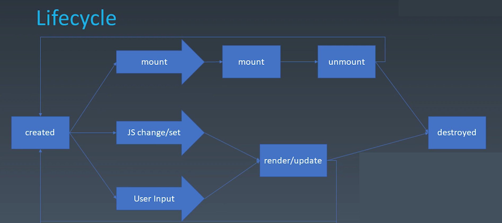
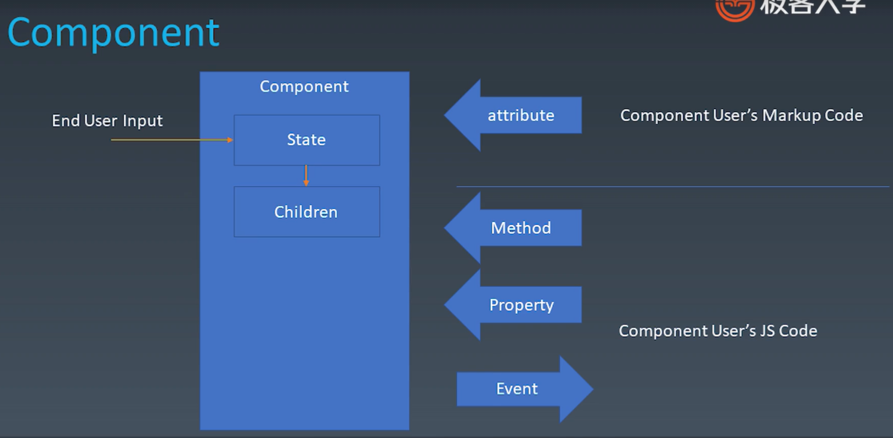
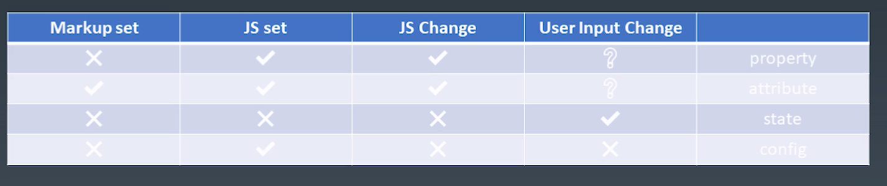

学习笔记

### 组件化

-   基本概念与组成部分
    -   对象
        -   Properties
        -   Methods
        -   Inherit
    -   组件
        -   与 UI 强相关，十分合适描述 UI
        -   既是对象又是模块
        -   以树形结构来组合，并且有一定模板化的配置能力
        -   Properties
        -   Methods
        -   Inherit
        -   Attribute
            -   特性
            -   Component User's Markup Code
            -   Attribute VS property
                -   Attribute 强调描述性
                -   Properly 强调从属关系
                -   ```html
                    <div class="cls1 cls2"></div>
                    <script>
                        var div = document.getElementByTagName('div)
                        div.className // cls1 cls2
                    </script>
                    ```
                -   ```html
                    <div class="cls1 cls2" style="color:bule"></div>
                    <script>
                        var div = document.getElementByTagName('div)
                        div.style // 字符串转化对象
                    </script>
                    ```
                -   ```html
                    <a href="//m.taobao.com"></a>
                    <script>
                        var a = document.getElementsByTagName("a");
                        a.href; // 'http://m.taobao.com'，这个URL是resolve过的结果
                        a.getAttribute("href"); // '//m.taobao.com'，跟HTML代码完全一致
                    </script>
                    ```
                -   ```html
                    <input value="cute" />
                    <script>
                        var input = document.getElementsByName("input");
                        // 若property没有设置，则结果是attribute
                        input.value; // cute
                        input.getAttribute("value"); // cute
                        input.value = "hello"; // 若value属性已经设置，则attribute不变，property变化，元素上实际的效果property优先
                        input.value; // hello
                        input.getAttribute("value"); // cute
                    </script>
                    ```
        -   Config & State
        -   Event
        -   Lifecycle
            -   created ——> destroyed
            -   
            -   mount 组件被创建并挂在到界面上
        -   Children
            -   content 型 Children
                -   有几个 children 最终显示几个
            -   Template 型 Children
                -   充当模板的作用，不一定反应实际渲染出来的效果，类似 list 组件
        -   
        -   Properties 和 Methods 是 使用组件的程序员 ——> 开发组件的程序员 传递消息
        -   Event 开发组件的程序员 ——> 使用组件的程序员 传递消息
        -   如何设计组件状态
            -   
            -   **config 只有组件在被构造时才触发，一次性传入，不可被更改**
