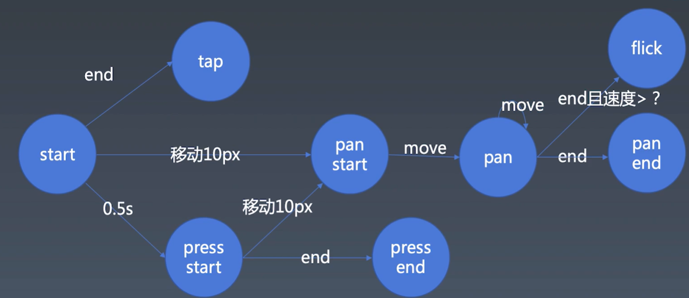

学习笔记

-   手势与动画

    -   gesture

        -   
        -   tap —— 短按，类似鼠标点击事件
        -   pan —— 手指在屏幕上移动，一般以 10px 为阈值判断是否有移动
        -   flick —— 在 pan 与 pan end 之间，end 的速度达到一定值，触发一次轻扫（或者叫 swipe）
        -   press —— 长按，手指按住不放 500ms 触发 press start，如果长按后的位移超过 10px，则会认为触发了 pan 事件，进入 pan start

    -   对 mouse 系列事件和 touch 系列事件的统一抽象

        -   ```js
            let element = document.documentElement;

            // 移动端无法触发mouse系列事件
            element.addEventListener("mousedown", (event) => {
                start(event);

                let mousemove = (event) => {
                    move(event);
                };
                let mouseup = (event) => {
                    end(event);
                    element.removeEventListener("mousemove", mousemove);
                    element.removeEventListener("mouseup", mouseup);
                };

                element.addEventListener("mousemove", mousemove);
                element.addEventListener("mouseup", mouseup);
            });

            // touchstart之后一定会触发touchmove，两者一定在同一元素上触发
            element.addEventListener("touchstart", (event) => {
                // console.log(event.changedTouches); // touch事件可能是有多个触点，用identifier表示touch事件的唯一id，用于追踪出点
                for (let touch of event.changedTouches) {
                    start(touch);
                }
            });
            element.addEventListener("touchmove", (event) => {
                for (let touch of event.changedTouches) {
                    move(touch);
                }
            });
            element.addEventListener("touchend", (event) => {
                for (let touch of event.changedTouches) {
                    end(touch);
                }
            });

            // touchcancel表示touch点序列以异常模式去结束
            element.addEventListener("touchcancel", (event) => {
                for (let touch of event.changedTouches) {
                    cancel(touch);
                }
            });

            let start = (point) => {
                console.log("start", point.clientX, point.clientY);
            };
            let move = (point) => {
                console.log("move", point.clientX, point.clientY);
            };
            let end = (point) => {
                console.log("end", point.clientX, point.clientY);
            };
            let cancel = (point) => {
                console.log("cancel", point.clientX, point.clientY);
            };
            ```

    -   gesture 的逻辑

        -   这里先实现 tap、pan、press，思路就是用几个标记变量 isTap、isPan、isPress 标记是否产生对应事件。
        -   每次在 start 的时候初始化，move 和 end 的时候做相应处理判断是哪一种。
        -   由于 press 有 500ms 延迟，需要用 setTimeout，后面 move、end、cancel 都需要做 clearTimeout 处理。
        -   ```js
            let handler;
            let startX, startY;
            let isPan = false;
            let isTap = true;

            let start = (point) => {
                // console.log("start", touch.clientX, touch.clientY);
                (startX = point.clientX), (startY = point.clientY);

                isTap = true;
                isPan = false;
                isPress = false;

                handler = setTimeout(() => {
                    isTap = false;
                    isPan = false;
                    isPress = true;
                    handler = null;
                    console.log("press start");
                }, 500);
            };
            let move = (point) => {
                let dx = point.clientX - startX,
                    dy = point.clientY - startY;

                if (!isPan && dx ** 2 + dy ** 2 > 100) {
                    isTap = false;
                    isPan = true;
                    isPress = false;
                    console.log("pan start");
                    clearTimeout(handler);
                }

                if (isPan) {
                    console.log(dx, dy);
                    console.log("pan");
                }

                // console.log("move", touch.clientX, touch.clientY);
            };
            let end = (point) => {
                if (isTap) {
                    console.log("tap");
                    clearTimeout(handler);
                }
                if (isPan) {
                    console.log("pan end");
                }
                if (isPress) {
                    console.log("press end");
                }
                // console.log("end", touch.clientX, touch.clientY);
            };
            let cancel = (point) => {
                clearTimeout(handler);
                // console.log("cancel", touch.clientX, touch.clientY);
            };
            ```

        -   处理鼠标事件

            -   在 mousedown 和 mouseup 事件中，可以通过 evevnt.button 来获取当前操作的鼠标按键，表示为一个数值：
                -   0 -> 主按键，通常指鼠标左键或默认值
                -   1 -> 辅助按键，通常指鼠标滚轮中键
                -   2 -> 次按键，通常指鼠标右键
                -   3 -> 第四个按键，通常指浏览器后退键
                -   4 -> 第五按键，通常指浏览器前进按键
            -   在 mousemove 事件中，可以通过 event.buttons 来获取按键信息，采用二进制掩码设计，可对应多个键，按下多个键对应的返回值其实也就是各个按键对应值相加（二进制掩码进行或 | 运算）：
                -   0 -> 没有按键或者是没有初始化
                -   1 -> 鼠标左键
                -   2 -> 鼠标右键
                -   4 -> 鼠标中键
                -   8 -> 第四个按键，通常指浏览器后退键
                -   16 -> 第五按键，通常指浏览器前进按键
            -   ```js
                let element = document.documentElement;

                let isListeningMouse = false;

                // 移动端无法触发mouse系列事件
                element.addEventListener("mousedown", (event) => {
                    let context = Object.create(null);
                    contexts.set("mouse" + (1 << event.button), context);

                    start(event, context);

                    let mousemove = (event) => {
                        let button = 1;

                        while (button <= event.buttons) {
                            if (button & event.buttons) {
                                //   event.button和event.buttons中鼠标按键的顺序是不同的
                                let key;
                                if (button == 2) {
                                    key = 4;
                                } else if (button == 4) {
                                    key = 2;
                                } else {
                                    key = button;
                                }
                                let context = contexts.get("mouse" + key);
                                move(event, context);
                            }
                            button = button << 1;
                        }
                    };

                    let mouseup = (event) => {
                        let context = contexts.get(
                            "mouse" + (1 << event.button)
                        );
                        end(event, context);
                        contexts.delete("mouse" + (1 << event.button));

                        if (event.buttons === 0) {
                            element.removeEventListener("mousemove", mousemove);
                            element.removeEventListener("mouseup", mouseup);
                            isListeningMouse = false;
                        }
                    };

                    if (!isListeningMouse) {
                        element.addEventListener("mousemove", mousemove);
                        element.addEventListener("mouseup", mouseup);
                        isListeningMouse = true;
                    }
                });
                ```

    -   派发事件

        -   有了前面的处理，还要在对应的时机把真正的事件派发出来。这里就基于浏览器原生的 Event 进行封装，可以参考 Event。
        -   ```js
            function dispatch(type, properties) {
                let event = new Event(type);
                for (let name in properties) {
                    event[name] = properties[name];
                }
                element.dispatchEvent(event);
            }
            ```
        -   使用的时候就是传递事件类型和对应的属性
        -   ```js
            let end = (point, context) => {
                if (context.isTap) {
                    dispatch("tap", {});
                    clearTimeout(context.handler);
                }
            };
            ```

    -   flick 事件

        -   flick 需要计算速度，所以在 start 的时候需要多存一个按下时间 t，这里用一个 point 存 t 和对应的 x、y 坐标，start 的时候初始化 points 数组，move 和 end 的时候都要先过滤掉 500ms 以上的 point，这样计算速度总是最新的速度。最后是根据速度值判断是否派发 flick 事件。
        -   ```js
            let start = (point, context) => {
                // ...
                context.points = [
                    {
                        t: Date.now(),
                        x: point.clientX,
                        y: point.clientY,
                    },
                ];
            };
            let move = (point, context) => {
                // ...
                context.points = context.points.filter(
                    (point) => Date.now() - point.t < 500
                );

                context.points.push({
                    t: Date.now(),
                    x: point.clientX,
                    y: point.clientY,
                });
            };
            let end = (point, context) => {
                // ...
                context.points = context.points.filter(
                    (point) => Date.now() - point.t < 500
                );

                let d, v;
                if (!context.points.length) {
                    v = 0;
                } else {
                    d = Math.sqrt(
                        (point.clientX - context.points[0].x) ** 2 +
                            (point.clientY - context.points[0].y) ** 2
                    );
                    v = d / (Date.now() - context.points[0].t);
                }

                if (v > 1.5) {
                    console.log("flick");
                    context.isFlick = true;
                } else {
                    context.isFlick = false;
                }
                console.log("v:", v);
            };
            ```

    -   封装
        -   可以把实现分为 3 部分：
            -   Listener，负责监听元素
            -   Recognizer，负责事件处理
            -   Dispatcher，负责派发真正的事件
        -   调用形式可以是这样，对需要做手势处理的元素绑定即可
            -   ```js
                class Listener {
                    // ...
                }
                class Recognizer {
                    // ...
                }
                class Dispatcher {
                    // ...
                }
                export function enableGesture(element) {
                    new Listener(
                        element,
                        new Recognizer(new Dispatcher(element))
                    );
                }
                ```
