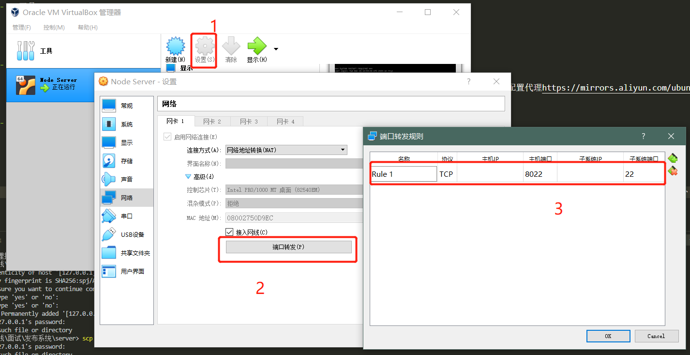

学习笔记

### 发布系统

-   线上服务系统 —— 对真正的用户提供线上服务
-   发布系统 —— 程序开发人员向线上服务系统发布所用的系统
-   发布工具 —— 使用命令行工具与发布系统相连接
-   工具
    -   虚拟机 —— Oracle VM VirtualBox 下载地址： https://www.virtualbox.org/
    -   Ubuntu 20.04.1 LTS (Focal Fossa) 下载地址：
        -   官网： https://releases.ubuntu.com/20.04/
        -   网盘： https://pan.baidu.com/s/1s8lga6YxuVcOdcAdhGQqoQ，提取码：b8yw
-   初始化 server
    -   1、安装虚拟机，创建 Ubuntu 64 位操作系统（64 位系统需要在 BIOS 启动相应选项才能创建）
    -   2、启动虚拟环境，首次启动需要安装操作系统光盘镜像，此处有官网下载 ubuntu-20.04.1-live-server-amd64.iso，配置代理https://mirrors.aliyun.com/ubuntu，创建用户，设置密码，重启虚拟机
    -   3、进入用户，apt 安装 nodejs 和 npm（更细新版本的 node——npm install -g n）
-   利用 Express 编写服务器
    -   Express 最广泛应用的服务器框架
    -   npx express-generator 初始化服务器项目文件夹 server
    -   _项目文件下的 public 文件_
    -   将 server 文件夹部署到虚拟机服务器上
    -   ubuntu 服务器上使用命令 service ssh start 启动服务（默认不启动），默认监听 22 端口
    -   端口映射
        -   
    -   `scp -P 8022 -r D:\全栈\面试\发布系统\server\* finder@127.0.0.1:/home/finder/server` 将 server 文件 copy 到虚拟机服务器 /home/finder/server 文件
-   用 node 启动一个简单的 server
    -   publish-server 向真实的 server 复制自己的文件
        -   ```js
            let http = require("http");
            http.createServer(function (req, res) {
                console.log(req);
                res.end("Hello world");
            }).listen(8082);
            ```
    -   publish-tool 向 publish-server 发送想要发布的文件
        -   ```js
            let http = require("http");
            let request = http.request(
                {
                    hostname: "127.0.0.1",
                    port: 8082,
                },
                (response) => {
                    console.log(response);
                }
            );
            request.end();
            ```
-   node.js 的流
    -   stream.Readable
        -   Event:'close'
        -   Event:'data'
    -   stream.Writable
        -   write()，异步，callback
        -   end()
    -   request 为 Readable 的 stream
    -   readable.pipe 将可读的流导入进一个可写的流
        -   ```js
            let request = http.request(
                {
                    hostname: "127.0.0.1",
                    port: 8082,
                    method: "post",
                    headers: {
                        "Content-Type": "application/octet-stream",
                    },
                },
                (response) => {
                    // console.log(response);
                }
            );
            let file = fs.createReadStream("./sample.html");
            file.pipe(request);
            ```
-   改造 server
    -   ```js
        //  publish.js
        let http = require("http");
        let fs = require("fs");
        let request = http.request(
            {
                hostname: "127.0.0.1",
                port: 8882,
                method: "post",
                headers: {
                    "Content-Type": "application/octet-stream",
                },
            },
            (response) => {
                console.log(response);
            }
        );
        let file = fs.createReadStream("./sample.html");
        file.on("data", (chunk) => {
            console.log(chunk.toString());
            request.write(chunk);
        });
        ```
    -   ```js
        //  server.js
        let http = require("http");
        let fs = require("fs");
        http.createServer(function (request, response) {
            console.log(request.headers);
            let outFile = fs.createWriteStream("../server/public/index.html");
            request.on("data", (chunk) => {
                // console.log(chunk.toString());
                outFile.write(chunk);
            });
            request.on("end", () => {
                outFile.end();
                response.end("Success");
            });
        }).listen(8082);
        ```
-   实现多文件发布
    -   需要使用 Node 里面压缩相关的包
    -   archiver
    -   unzipper
-   用 GitHub oAuth 做一个登陆实例
    -   1、首先要申请一个 GitHub App，设置认证通过后回调 api
    -   2、在 client 端调用`https://github.com/login/oauth/authorize`，在浏览器里调用，可以简单用 nodejs 的 child_process 执行 child_process.exe(start `https://github.com/login/oauth/authorize?client_id=${GitHub App 申请的 client_id})`(window 下用 start 表示在浏览器中打开)
    -   3、前面设置的回调 api 要在 server 端实现，接收到 code 之后加上 GitHub App 申请的 client_id 和 client_sercet 换取 token，调用 api 为`https://github.com/login/oauth/access_token`，需要用 https 库调用
    -   4、得到这个 token 之后实际上 server 就可以调用 Github 的 api 获取身份信息，判断身份通过就可以执行之前上传文件的操作了。client 端需要知道上传时机，可以简答在 client 端实现一个服务器，server 在获取 token 后回传请求把 token 传给 client，client 再回传 token 给 server 并把文件上传。
    -   _实际的发布系统可以接入任意鉴权系统_
